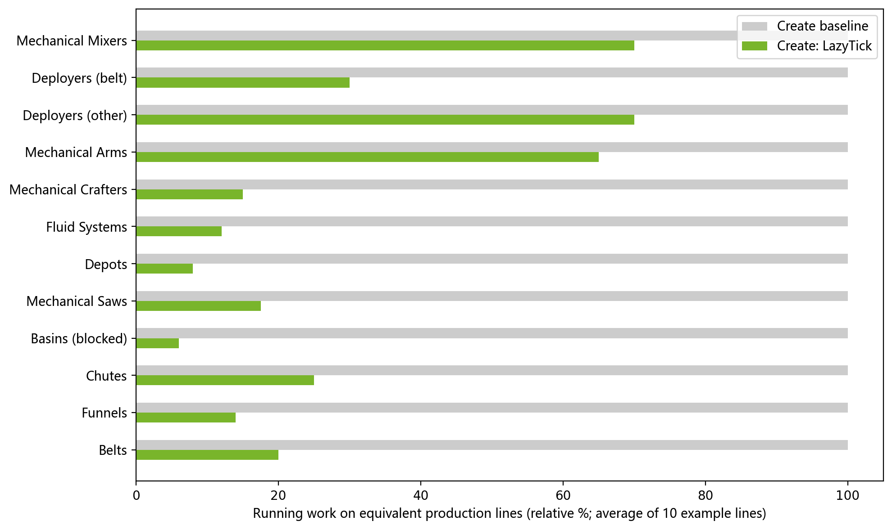

<p align="center">
  
</p>

<p align="center">
  English | <a href="README_zh.md">简体中文</a>
</p>

<p align="center">
  <a href="https://modrinth.com/mod/createlazytick"></a>
  <a href="https://www.curseforge.com/minecraft/mc-mods/create-lazytick"></a>
</p>

# Create: LazyTick

Create: LazyTick (CLT) is a performance addon for
[Create](https://github.com/Creators-of-Create/Create). It reduces repeated,
unproductive ticking in Create automation while retaining normal processing,
event-driven wakeups, and bounded retry paths for machines that still need to
make progress.

CLT is intended for Create-heavy modpacks and servers where many machines are
idle, waiting for inputs, waiting for output capacity, or repeatedly searching
large recipe sets. It is not a replacement for profiling, sensible factory
design, or a server with enough CPU for the workload.

## What It Optimizes

CLT combines two approaches:

- **Lazy scheduling** reduces polling while an eligible machine is idle or in a
  bounded retry state.
- **Recipe and state caches** avoid repeating expensive recipe and capability
  searches when the relevant machine state has not changed.

The active optimization surface includes:

| Area | Optimized Create components |
| --- | --- |
| Logistics | Belts, funnels, chutes, depots, and item drains. |
| Processing | Basins, mechanical crafters, saws, deployers, spouts, and recipe lookup paths. |
| Interaction | Mechanical arms and selected block-entity interaction checks. |
| Fluids | Configurable global fluid-transfer scheduling. |

The benchmarks published on the project's [MC百科 page](https://www.mcmod.cn/class/23850.html)
show the intended type of savings: idle belts, funnels, chutes, depots, and
basins can avoid most unnecessary work, while recipe-heavy machines benefit
more as recipe count grows. Exact results depend on Create version, addons,
factory topology, configuration, and the distinction between idle and active
time; they are examples, not performance guarantees.

## Benchmark Overview

The published comparison below summarizes the average running work of the
sample production lines before and after CLT; lower green bars are better.




## Supported Versions

Choose a jar that matches *both* Minecraft and Create.

| Loader | Minecraft | Create target |
| --- | --- | --- |
| Forge | 1.19.2 | 0.5.1.i |
| Forge | 1.20.1 | 0.5.1.j |
| Forge | 1.20.1 | 6.0.x |
| NeoForge | 1.21.1 | 6.0.x |

Create is required. CLT is a client-and-server mod: install the matching CLT
build on the server and on every connecting client.

## Installation

1. Install the matching Create build and its normal loader dependencies.
2. Download the CLT jar for the same Minecraft, loader, and Create generation.
3. Put CLT in the `mods` folder on both server and clients.
4. Start once to generate the configuration files, then test representative
   automation before rolling it out to a production world.

Back up worlds before updating a modpack. CLT does not deliberately rewrite
world data, but automation timing is gameplay behavior and must be verified in
the actual pack.

## Lazy Clock

CLT adds a **Lazy Clock** for per-machine control. Use it on an eligible Create
block entity to cycle the configured optimization level. The default cycle is
`0`, `25`, `50`, `75`, and `100` percent:

- `0` disables CLT optimization for that machine and keeps it at normal cadence.
- Higher values raise the allowed lazy interval.
- **Dynamic mode** adjusts the upper bound used by CLT's adaptive/backoff logic.
- **Forced mode** applies a fixed interval percentage instead.

The server configuration controls the default mode and the cycle values. The
client overlay and Create-goggle information can show the current state for
supported machines.

## Configuration

The generated server configuration contains independent switches and limits for
each optimization family. Typical files are:

```text
config/createlazytick-server.toml
config/createlazytick-client.toml
```

Important groups include:

| Group | Examples |
| --- | --- |
| `general` | Global enable switch, logging, and recipe-cache recording delay. |
| `fluids` | Global fluid scheduling and its maximum delay. |
| `logistics` | Funnel, chute, and belt lazy-tick switches and maximum delays. |
| `processing` | Depot, saw, basin, item drain, deployer, and spout controls. |
| `crafter` | Mechanical-crafter recipe cache and redstone scheduling controls. |
| `arm` | Mechanical-arm delay, full-speed exclusions, and weak-lazy targets. |
| `lazytick-clock` | Lazy Clock cycle values and default dynamic/forced mode. |

Start with the defaults. Increase a limit only after testing the corresponding
machine, rather than applying one aggressive value to every factory.

## Compatibility and Timing

CLT deliberately keeps several safety boundaries at normal or bounded cadence.
For example, a funnel adjacent to a portable storage interface stays on Create's
normal funnel cadence, and a saw with blocked output uses a retrying wait rather
than sleeping permanently. These paths protect short interaction windows and
eventual output progress.

Nevertheless, any optimization that reduces polling can add visible delay to
machine animations or to contraptions designed around one-game-tick timing. In
particular:

- Do not assume a redstone pulse shorter than a configured lazy interval will
  wake an inactive machine.
- Test addon machines and custom recipes, especially when they subclass or
  extend Create processing block entities.
- Use the Lazy Clock to keep timing-critical machines at full speed instead of
  disabling CLT globally.
- Report a compatibility issue with the Minecraft/Create/CLT versions, loader,
  full logs, relevant addon list, configuration, and a minimal reproduction.

## Reporting Issues

Please report bugs and compatibility problems through
[GitHub Issues](https://github.com/duckgun13476/Create-LazyTick/issues). Include
the affected versions, logs from both sides when applicable, the relevant CLT
configuration, and steps that reproduce the behavior.

## Development Layout

This repository uses the BO/CSC/CEC combined multi-version layout:

- The root Gradle wrapper orchestrates builds across all maintained targets.
- `common/` is a source/resource fragment injected into each target; it is not
  a standalone cross-version runtime dependency.
- `project/<loader>/<version>/` holds version-specific APIs, Mixins, metadata,
  and dependencies.

Useful root tasks:

```powershell
.\gradlew.bat compileJavaAllVersions
.\gradlew.bat packageAllVersions
```

## License

Create: LazyTick is licensed under [GNU GPLv3](LICENSE) (`GPL-3.0-only`).
