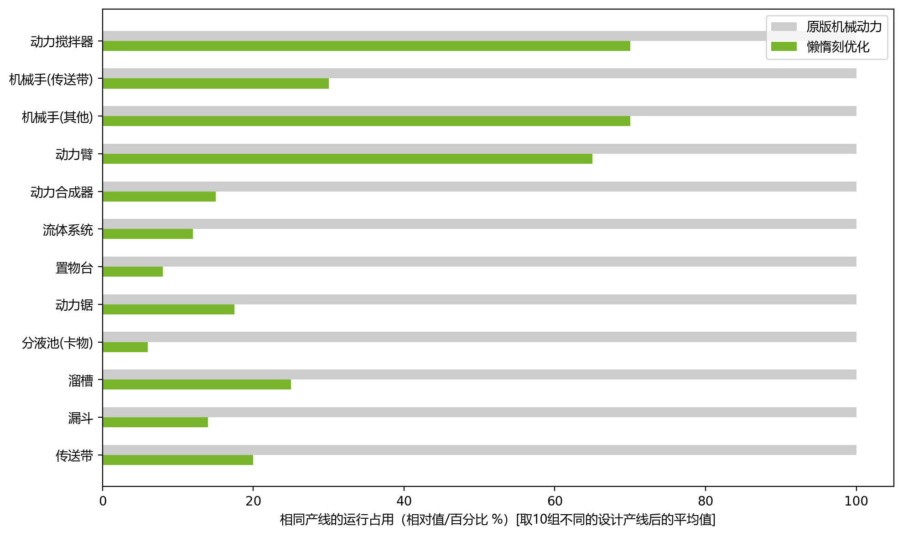

<p align="center">
  
</p>

<p align="center">
  <a href="README.md">English</a> | 简体中文
</p>

<p align="center">
  <a href="https://modrinth.com/mod/createlazytick"></a>
  <a href="https://www.curseforge.com/minecraft/mc-mods/create-lazytick"></a>
</p>

# 机械动力：懒惰刻

机械动力：懒惰刻（Create: LazyTick，CLT）是
[机械动力](https://github.com/Creators-of-Create/Create) 的性能优化附属模组。它会降低
Create 自动化中反复发生、却没有有效产出的无意义轮询，同时保留正常加工、事件唤醒，以及需要
持续推进的受阻重试路径。

它面向拥有大量 Create 机器的整合包与服务器：机器可能长期空转、等待输入、等待输出空间，或在
巨量配方中反复搜索。它不能替代性能分析、合理的产线设计，或足够的服务器 CPU 性能。

## 优化内容

CLT 同时使用两类手段：

- **懒惰调度**：在方块适合休眠或可安全进行有界重试时，降低无意义的轮询频率。
- **配方与状态缓存**：机器的相关状态未变化时，避免重复进行昂贵的配方和能力搜索。

当前覆盖的优化面：

| 类别 | 覆盖的机械动力元件 |
| --- | --- |
| 物流 | 传送带、漏斗、溜槽、置物台、物品排水口。 |
| 加工 | 分液池、动力合成器、动力锯、机械手、注液器与配方查找路径。 |
| 交互 | 动力臂与部分方块实体交互检测。 |
| 流体 | 可配置的全局流体传输调度。 |

项目 [MC百科页面](https://www.mcmod.cn/class/23850.html) 记录了实机测得的典型收益：静态的
传送带、漏斗、溜槽、置物台与分液池可以减少绝大多数无效占用；配方越多，配方缓存的收益通常越
明显。数据是特定版本、整合包、产线结构与配置下的实测样本，不是对所有环境的性能承诺。

## 实测总览

下图汇总示例产线安装 CLT 前后的平均运行占用；绿色越短，代表占用越低。




## 支持版本

请同时匹配 Minecraft、加载器和机械动力版本。

| 加载器 | Minecraft | 机械动力目标版本 |
| --- | --- | --- |
| Forge | 1.19.2 | 0.5.1.i |
| Forge | 1.20.1 | 0.5.1.j |
| Forge | 1.20.1 | 6.0.x |
| NeoForge | 1.21.1 | 6.0.x |

前置模组为机械动力。CLT 需要在服务端和所有连接客户端上安装同一目标版本的构建。

## 安装

1. 安装匹配版本的机械动力及其正常前置。
2. 下载与 Minecraft、加载器和机械动力代际完全对应的 CLT jar。
3. 将 CLT 同时放入服务端和客户端的 `mods` 文件夹。
4. 首次启动生成配置后，先在测试世界或代表性产线上验证，再部署到正式存档。

更新整合包前请备份存档。CLT 不会刻意修改世界数据，但自动化的时序本身就是游戏行为，必须在真实
整合包环境中确认。

## 懒惰时钟

CLT 添加了 **懒惰时钟**，可对单个支持的机械动力方块实体进行控制。用时钟右键机器可循环切换优化
等级；默认序列为 `0`、`25`、`50`、`75`、`100`：

- `0`：关闭该机器的 CLT 优化，保持机械动力原本的运行频率。
- 更高数值：提高允许的最大懒惰间隔。
- **动态模式**：调整 CLT 自适应/退避逻辑可使用的上限。
- **强制模式**：使用固定间隔百分比，而非动态调整。

服务端配置可更改默认模式和循环数值；客户端叠加提示和机械动力护目镜信息可展示支持机器的当前状态。

## 配置

生成后的主要配置文件通常位于：

```text
config/createlazytick-server.toml
config/createlazytick-client.toml
```

服务端配置将不同优化拆分为独立开关和上限：

| 分组 | 内容 |
| --- | --- |
| `general` | 总开关、日志与配方缓存重新记录延时。 |
| `fluids` | 全局流体调度与最大延时。 |
| `logistics` | 漏斗、溜槽、传送带的懒惰刻开关和上限。 |
| `processing` | 置物台、动力锯、分液池、物品排水口、机械手、注液器。 |
| `crafter` | 动力合成器的配方缓存与红石调度。 |
| `arm` | 动力臂延迟、全速例外和弱懒惰目标。 |
| `lazytick-clock` | 懒惰时钟循环序列与动态/强制默认模式。 |

建议从默认配置开始，只在测试对应机器后再提高该机器的延迟上限，而不是给所有产线套用一个激进数值。

## 兼容性与时序

CLT 会为短暂交互窗口和持续输出保留必要的正常/有界重试节奏。例如，贴着便携式存储接口的漏斗会
保留机械动力的正常漏斗频率；动力锯输出受阻时会进入可重试的等待，而不会永久休眠。

但任何降低轮询频率的优化都可能让动画或依赖单刻同步的产线出现额外延迟。请注意：

- 不要假设短于已配置懒惰间隔的红石脉冲，必然能唤醒处于休眠状态的机器。
- 请测试附属模组机器与自定义配方，尤其是继承或扩展机械动力加工方块实体的实现。
- 对时序关键机器，优先使用懒惰时钟设为全速，而不是全局关闭 CLT。
- 反馈问题时请附上 Minecraft / Create / CLT 版本、加载器、完整日志、相关附属列表、配置和最小复现。

## 反馈问题

请通过 [GitHub Issues](https://github.com/duckgun13476/Create-LazyTick/issues) 提交 bug 与兼容性问题。
客户端和服务端都参与时，请提供两侧日志。

## 开发结构

本仓库采用 BO/CSC/CEC 风格的组合多版本结构：

- 根 Gradle wrapper 编排所有维护目标的构建。
- `common/` 是注入到各目标的源码/资源片段，不是跨版本运行时二进制依赖。
- `project/<loader>/<version>/` 存放各版本的 API、Mixin、元数据与依赖差异。

常用根任务：

```powershell
.\gradlew.bat compileJavaAllVersions
.\gradlew.bat packageAllVersions
```

## 许可证

机械动力：懒惰刻使用 [GNU GPLv3](LICENSE) 许可证（`GPL-3.0-only`）。
